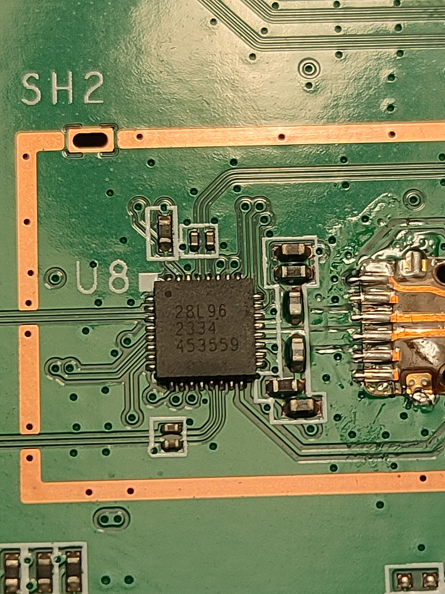

# Hardware Specifications

|                 |                                                                            |
| --------------- | -------------------------------------------------------------------------- |
| Vendor/Brand    | Comtrend                                                                   |
| Model           | GRG-4362                                                                   |
| Chipset         | Realtek RTL9615C                                                           |
| Flash           | SPI NAND 128MiB (Winbond W25N01GVZEIG)                                     |
| RAM             | DDR4-1866 512MiB                                                           |
| CPU             | Dualcore AArch64 A55                                                       |
| CPU Clock       | 1000MHz                                                                    |
| Bootloader      | U-Boot 2022.10                                                             |
| System          | Linux 5.10.70 (Realtek ASDK64-10.2.0 Build 3544)                           |
| Load addr       | 0x01800000                                                                 |
| Ethernet ports  | 1x10G  (Supports 2.5Gbase-T and 5Gbase-T)                                  |
| PHY Ethernet    | RTL8261B                                                                   |
| Optics          | SC/APC (SEMTECH GN28L96)                                                   |
| IP address      | 192.168.1.1/24                                                             |
| Web Gui         | ✅ user `root`, password `root`                                            |
| SSH             | ✅                                                                         |
| Telnet          | ✅                                                                         |
| FTP             | ✅, Download only                                                          |
| Serial          | ✅                                                                         |
| Serial baud     | 115200                                                                     |
| Serial encoding | 8-N-1                                                                      | 
| Form Factor     | ONT                                                                        |

## List of software versions
### HW V2.0 
- CTN-1.0.8b16[^first] (Cetin) 
- CTN-1.0.8b2[^first] (Cetin)
[^first]: Firmware in this repository has been pre-patched to remove ISP configuration and allow full shell access.

## List of partitions
`cat /proc/mtd`

| dev   | size     | erasesize | name             |
| ----- | -------- | --------- | ---------------- |
| mtd0  | 00200000 | 00020000  | "boot"           |
| mtd1  | 00040000 | 00020000  | "env"            |
| mtd2  | 00040000 | 00020000  | "env2"           |
| mtd3  | 00040000 | 00020000  | "static_conf"    |
| mtd4  | 07cc0000 | 00020000  | "ubi_device"     |
| mtd5  | 00a0d000 | 0001f000  | "ubi_Config"     |
| mtd5  | 0005d000 | 0001f000  | "ubi_DTB0"       |
| mtd6  | 0060e000 | 0001f000  | "ubi_k0"         |
| mtd7  | 02017000 | 0001f000  | "ubi_r0"         |
| mtd8  | 0005d000 | 0001f000  | "ubi_DTB1"       |
| mtd8  | 0060e000 | 0001f000  | "ubi_k1"         |
| mtd9  | 02017000 | 0001f000  | "ubi_r1"         |

Only the first 4 partitions with erasesize 0x20000 should be manipulated using mtd devices, the fifth partition `ubi_device` contains the rest of the NAND and is to be manipulated using ubi volumes

## List of volumes (UBI)
`ubinfo -a`

| dev    | size      | type    | name             |
| ------ | --------- | ------- | ---------------- |
| ubi0_0 | 10539008 bytes, 10.1 MiB | dynamic | "ubi_Config"     |
| ubi0_1 | 380928 bytes, 372.0 KiB | dynamic | "ubi_DTB0"         |
| ubi0_2 | 6348800 bytes, 6.1 MiB | dynamic | "ubi_k0"         |
| ubi0_3 | 33648640 bytes, 32.1 MiB | dynamic | "ubi_r0"         |
| ubi0_4 | 380928 bytes, 372.0 KiB | dynamic | "ubi_DTB1"         |
| ubi0_5 | 6348800 bytes, 6.1 MiB | dynamic | "ubi_k1"         |
| ubi0_6 | 33648640 bytes, 32.1 MiB | dynamic | "ubi_r1"         |

To back up a volume, `cat` or `dd` the appropriate `/dev/ubi0_X` device to a file or pipe, to restore a volume, use the `ubiupdatevol` utility

This ONT supports dual boot.

Volumes `ubi_k0` and `ubi_r0` respectively contain kernel and rootfs of the first image, while `ubi_k1` and `ubi_r1` contain kernel and rootfs of the second one.

# Useful files and binaries

## Useful files
- `/var/config/config.xml` - Contains the user portion of the configuration
- `/var/config/config_hs.xml` - Contains the "hardware" configuration (which _should not_ be changed)
- `/var/config/rtkbosa_k.bin` - Laser driver calibration data, per-device unique (backup recomended)
- `/tmp/omcilog` - OMCI messages logs (must be enabeled, see below)

## Useful binaries
- `flash` - Used to manipulate the config files in a somewhat safe manner
- `mib` - Similar to the flash command, communicates with the configd daemon, has few additional options
- `nv` - Used to manipulate nvram storage, including persistent config entries via `nv setenv`/`nv getenv`
- `omcicli` - Used to interact with the running OMCI daemon
- `omci_app` - The OMCI daemon
- `diag` - Used to run low-level diagnostics commands on the onu
- `cli` - Comtrend limited cli

# Usage

## Enable telnet
By default, the firmware prohibits any access from LAN, access rules are stored in `/etc/config_default.xml` file under ACL_IP_TBL table containing zone 0 for LAN and zone 1 for WAN. 
Further patch to `/lib/libmib.so` is required to enable full shell.

# GPON ONU status

## Getting the operational status of the ONU

```sh
# diag rt_gpon get onu-state
ONU state: Operation State:Associated(O5.1)
```

## Getting OLT vendor information
```sh
# omcicli mib get 131
```

## Querying a particular OMCI ME
```sh
# omcicli mib get MIB_IDX
```

# GPON/OMCI settings

## Getting/Setting ONU GPON Serial Number
```sh
# flash get GPON_SN
GPON_SN=CMTD33221100
# flash set GPON_SN HWTC0A1B2C3D
```

## Getting/Setting ONU GPON PLOAM password

```sh
# flash get GPON_PLOAM_PASSWD
GPON_PLOAM_PASSWD=3030303030
# flash set GPON_PLOAM_PASSWD AAAAAAAAAA
```

## Getting/Setting ONU GPON LOID and LOID password
```sh
# flash get LOID
LOID=user
# flash set LOID user
# flash get LOID_PASSWD
LOID_PASSWD=user
# flash set LOID_PASSWD user
```

## Getting/Setting OMCI software version (ME 7)
```sh
# flash get OMCI_SW_VER1
OMCI_SW_VER1=CTN-1.0.8b16
# flash set OMCI_SW_VER1 V3R017C10S100
# flash get OMCI_SW_VER2
OMCI_SW_VER2=CTN-1.0.8b2
# flash set OMCI_SW_VER2 V3R017C10S100
```

## Getting/Setting OMCI hardware version (ME 256)
```sh
# flash get HW_HWVER
HW_HWVER=V2.0
# flash set HW_HWVER BF9.A
```

## Getting/Setting OMCI vendor ID (ME 256)
```sh
# flash get PON_VENDOR_ID  
PON_VENDOR_ID=CMTD
# flash set PON_VENDOR_ID HWTC
```

## Getting/Setting OMCI equipment ID (ME 257)
```sh
# flash get GPON_ONU_MODEL
GPON_ONU_MODEL=GRG-4362
# flash set GPON_ONU_MODEL HG8240H
```

## Getting/Setting OMCI OLT Mode and Fake OMCI

Configure how ONT handle OMCI from OLT:

```sh
# flash get OMCI_OLT_MODE
OMCI_OLT_MODE=1
# flash set OMCI_OLT_MODE 2
```

| Value | Note            | OMCI Information                                                                                       |
| ----- | --------------- | ------------------------------------------------------------------------------------------------------ |
| 0     | Default Mode    | Stock setting, most values cannot be changed                                                           |
| 1     | Huawei OLT Mode | Huawei                                                                                                 |
| 2     | ZTE OLT Mode    | ZTE                                                                                                    |
| 3     | Customized Mode | Custom Software/Hardware Version, OMCC, etc...                                                         |

Some vendors/wholesale providers/ISPs have explicit LAN Port Number provisioning or proprietary OMCI that the cannot understand, this will make the reply OK to whatever the OLT sends it via OMCI. 

`0` = Disable, `1` = Enable, Default is 0

```sh
# flash get OMCI_FAKE_OK
OMCI_FAKE_OK=0
# flash set OMCI_FAKE_OK 1
```

# Advanced settings

## Transferring files to/from the router

This router has a capability of sharing files using ftp, tftp and netcat.
Uploading any file to FTP server will attempt to use it as firmware update.

## Setting management MAC
```sh
# flash get ELAN_MAC_ADDR
ELAN_MAC_ADDR=1c6499a1b1c3
# flash set ELAN_MAC_ADDR 1c6499aabbcc
```

## Setting management IP
```sh
# flash get LAN_IP_ADDR
LAN_IP_ADDR=192.168.1.1
# flash set LAN_IP_ADDR 192.168.2.1
```

## Rebooting the ONU
```sh
mib commit;reboot
```

## Getting the MTU of the L2 bridge

```sh
# diag switch get max-pkt-len port all 
Port Speed
----------
0    9022
1    9022
2    9022
3    9022
4    9022
5    9022
6    12000
7    12000

```

## Checking the currently active image info
```sh
# nv getenv sw_active
sw_active=0
# nv getenv sw_version0
sw_version0=CTN-1.0.8b16
# nv getenv sw_version1
sw_version1=CTN-1.0.8b2
```

## Booting to a different image
```sh
# nv setenv sw_commit 0|1
# reboot
```

## Disable multicast U-Boot update
```sh
# nv setenv mupgrade_en 0
Enabled by default in Realtek U-Boot
Tool might exist out there but the PHY does not work on this device.
This speeds up boot time by 10s!
```


# Theardown and other photos





## Serial

The units have unpopulated pads for serial console in a 2x2 grid, after removing the solder the console is accessible through the ventilation grilles on the bottom cover.

You can easily communicate with the ONT using a TTL converter (for example the CH341A programmer in TTL mode) by soldering headers and connecting pins to the ONT following the pinout shown in the image above.

Once everything is ok, any TTY client, such as PuTTY, can be used to open the connection with its baud rate set to 115200. At this point, the ONT can be turned on.

Press any key once you see `Hit any key to stop autoboot` (You only have 1 second to do this so be quick) after which you get access to bootloader console which looks like this:
```sh
TAURUS#
```

## Firmware edit and update
Device rootfs is stored as simple SquashFS volumes.

Unpack, modification and repacking should be done as root user.

Extract image to new folder. 
```sh
unsquashfs -d rootfs_extracted/ CTN-1.0.8b2_rootfs.img 
```
Repack folder into an image
```sh
mksquashfs rootfs_extracted/ rootfs_new.img -comp xz -b 131072 -always-use-fragments -no-recovery -noappend
```
Flashing your images can be done through bootloader or from running system.

```sh
# U-Boot

loady ${tftp_base} 115200 
# Trigger Ymodem transfer from terminal client of your choice
setenv current_vol ubi_r0
run check_vol
ubi write ${tftp_base} ubi_r0 ${filesize}
reset
```

```sh
# Linux

nc -lp 9999 > /tmp/rootfs.img
md5sum /tmp/rootfs.img
ubiupdatevol ubi0_6 /tmp/rootfs.img
```

# Miscellaneous Links

- [Specsheet](https://www.comtrend.com/es/dbase/upload-img/download/DS_GRG-4362_V3.1_English.pdf)
- [Anime4000 Flash commands](https://github.com/Anime4000/RTL960x/blob/main/Docs/FLASH_GETSET_INFO.md)
- [Anime4000 OMCI MIB commands](https://github.com/Anime4000/RTL960x/blob/main/Docs/OMCI_CLI.md)
- [Anime4000 FW Modding](https://github.com/Anime4000/RTL960x/blob/main/Docs/Modify_Firmware.md)


