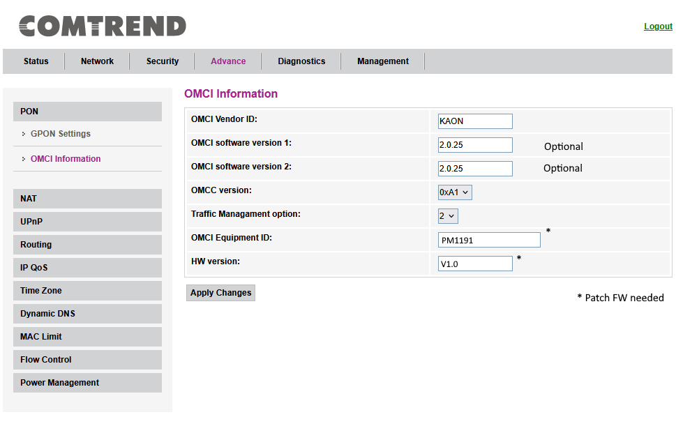
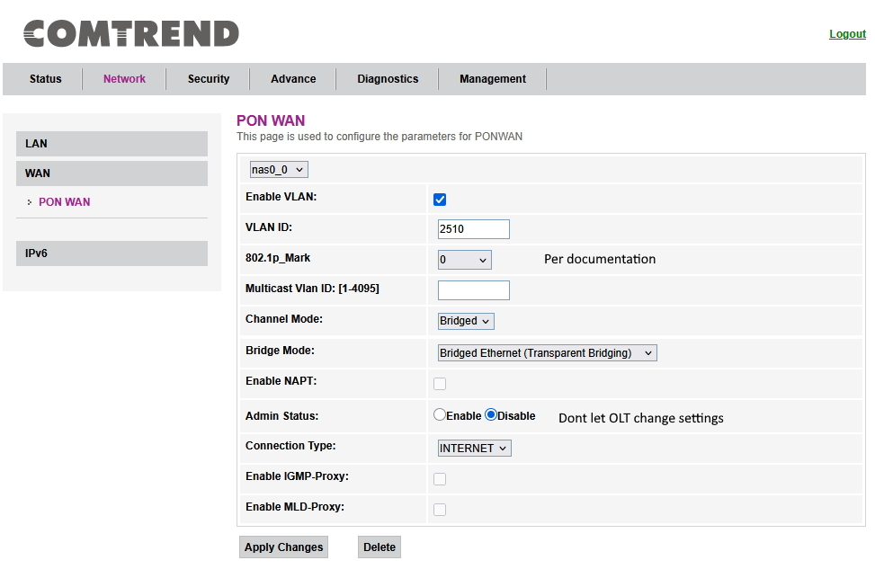

## Quick setup for T-Fiber
Even with mixed information available on the web regarding using your own devices on T-Mobiles own infrastructure, it is possible to do so.

For both GPON and XGS-PON, only serial number is used to authenticate ONU to OLT.

I verified this information when technician came to activate my service, although he noted that officially, this is not advertised anywhere and makes you responsible for any damage or disruption to their optical network.

All commands should be run with fiber unplugged. Information was taken from my KAON PM1191

### SSH configuration
```sh
# mib set OMCI_OLT_MODE 3
OMCI_OLT_MODE=3
# mib set OMCI_FAKE_OK 1
OMCI_FAKE_OK=1
# mib set GPON_SN KAON01234567
GPON_SN=KAON01234567
# mib commit
```

### Web UI configuration


VLAN 2510 is mapped to LAN port, passive bridge doesn't work for me and probably isn't needed.

After config is done save it from "Management -> Commit/Reboot" just to be sure (mib commit is done automaticly in intervals).

Sometimes when running flash/mib set settings didn't save after reboot so verify they are correct before plugging fiber in.

